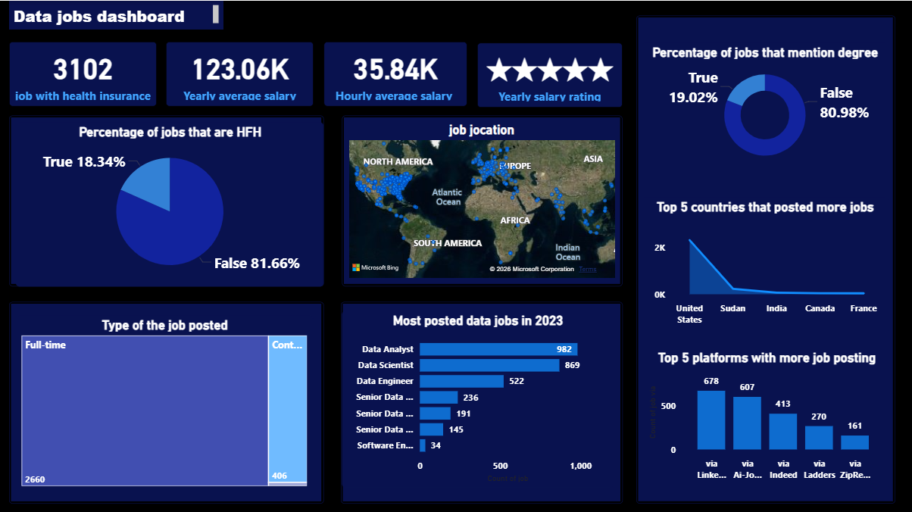

# 📊 Data Jobs Dashboard — Power BI

## 📌 Overview
An interactive **Power BI** dashboard analyzing a dataset of data-related job postings. It surfaces salary benchmarks, remote-work and benefit trends, geographic distribution, and which job titles, countries, and platforms dominate the market.

- **Tool used:** Power BI Desktop
- **Dataset:** Data-job postings (title, salary, location, work type, platform, benefits, degree requirement, HFH/remote flag)
- **Visuals used:** KPI cards, donut charts, pie chart, filled map, horizontal bar charts, area chart, treemap

---
## 🎯 Objectives
- Summarize headline salary and benefit stats for data jobs at a glance
- Show how common remote work ("HFH"), degree requirements, and health insurance are across postings
- Visualize where jobs are physically located worldwide
- Identify the most in-demand job titles, top hiring countries, and leading job platforms
- Break down postings by employment type (full-time vs. contract)

---

## 🖥️ Dashboard Walkthrough

### KPI Cards (top row)
- **3,102** — count of jobs that include health insurance as a benefit
- **$123.06K** — average yearly salary across postings
- **$35.84K** — average hourly salary
- **★★★★★** — yearly salary rating (a normalized/derived rating measure)

### Percentage of Jobs That Are HFH (pie chart)
Shows the split between remote-eligible ("Have From Home") postings and on-site roles: **18.34% True** vs **81.66% False** — remote roles remain a minority of listings.

### Job Location (filled/Bing map)
Plots every posting's location on a world map, giving a quick visual sense of where hiring activity is concentrated (dense clusters in North America and Europe).

### Type of the Job Posted (treemap)
Compares **Full-time (2,660)** vs. **Contract (406)** postings by relative size — full-time roles dominate the dataset by a wide margin.

### Most Posted Data Jobs in 2023 (horizontal bar chart)
Ranks job titles by posting count:
| Job Title | Postings |
|---|---|
| Data Analyst | 982 |
| Data Scientist | 869 |
| Data Engineer | 522 |
| Senior Data Analyst | 236 |
| Senior Data Scientist | 191 |
| Senior Data Engineer | 145 |
| Software Engineer | 34 |

### Percentage of Jobs That Mention a Degree (donut chart)
Only **19.02%** of postings explicitly mention a degree requirement, versus **80.98%** that don't — suggesting most data-job listings don't gate on formal education in the posting text.

### Top 5 Countries That Posted More Jobs (area chart)
Ranks the top hiring countries. The **United States** overwhelmingly leads posting volume, with a steep drop-off to Sudan, India, Canada, and France.

### Top 5 Platforms With More Job Posting (bar chart)
| Platform | Postings |
|---|---|
| LinkedIn | 678 |
| Ai-Jobs.net | 607 |
| Indeed | 413 |
| Ladders | 270 |
| ZipRecruiter | 161 |

---

## 📈 Key Insights
- Full-time roles vastly outnumber contract roles (2,660 vs. 406), indicating most employers hiring for data roles want permanent staff.
- Remote work (HFH) and explicit degree requirements are both minority attributes of postings — most listings are on-site and don't call out a degree requirement in the text.
- Data Analyst and Data Scientist are by far the most frequently posted titles, together accounting for more postings than every other title combined.
- Hiring is heavily concentrated in the United States, with LinkedIn and Ai-Jobs.net the leading platforms for job discovery.

---

## 🛠️ Skills Demonstrated
- Power BI report design: KPI cards, donut/pie charts, treemap, filled map, bar and area charts
- DAX measures for averages, percentages, and rating calculations
- Visual storytelling — laying out a single-page dashboard that answers multiple business questions at a glance

---

## 🚀 How to Use This Report
1. Download `dataset/data-jobs-dash.pbix`.
2. Open it in **Power BI Desktop** (free download from Microsoft).
3. Use any slicers/filters on the report to drill into specific titles, countries, or platforms (if included in your version of the report).

---

## 📬 Contact
**Usama Abdullahi Sani**
- LinkedIn: www.linkedin.com/in/usama-abdullahi-sani-60a2b6248
- Email: usamasaniabdullahi814@gmail.com
